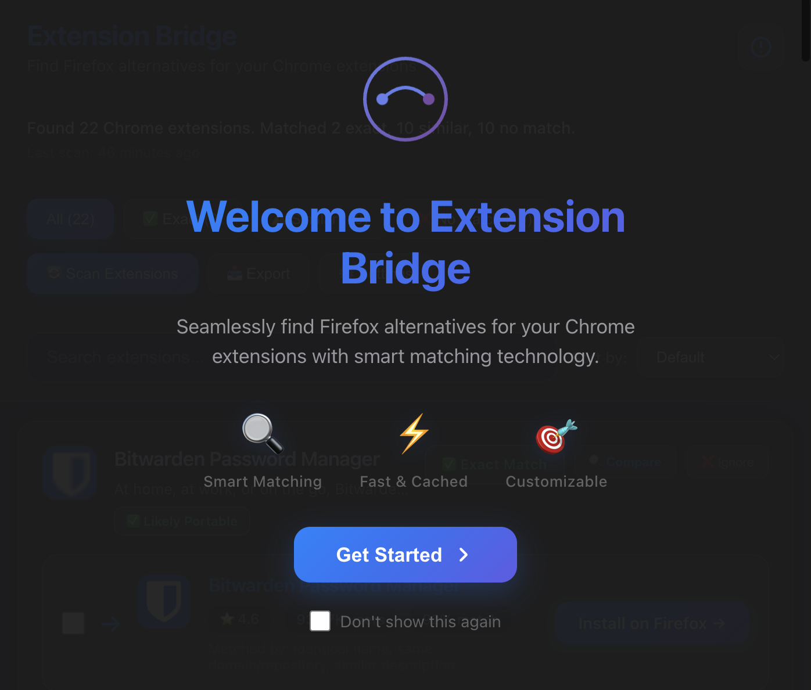
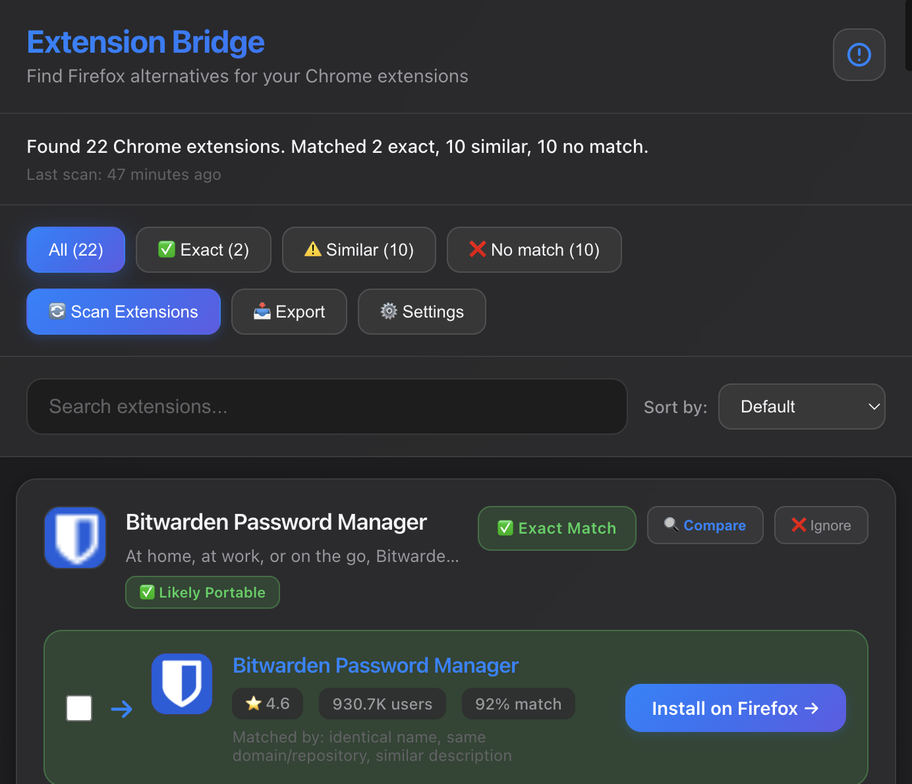
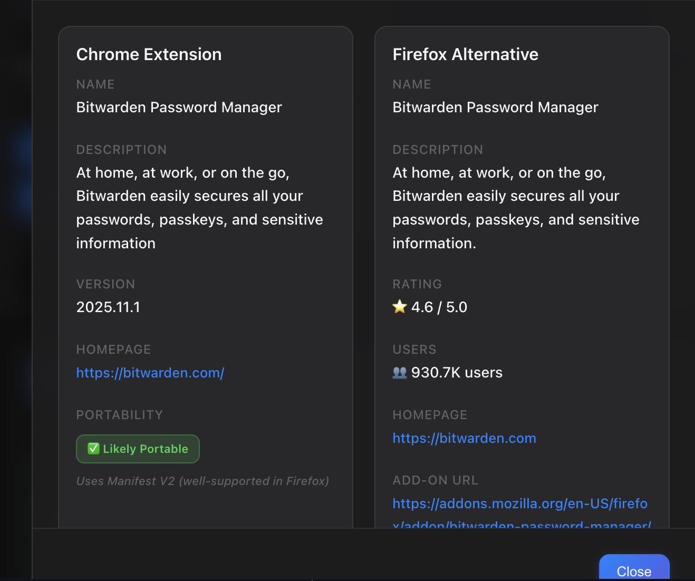
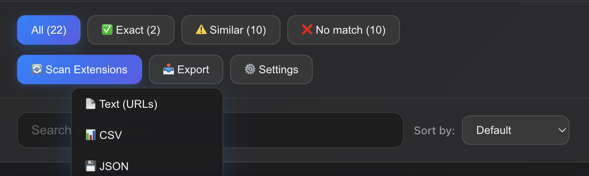

# Extension Bridge

A Chrome extension that scans your installed extensions and finds Firefox alternatives using Mozilla's Add-ons API.

**Website**: https://michaelnyc17.github.io/extension-bridge/

[](https://github.com/michaelnyc17/extension-bridge)
[](./LICENSE)
[](https://chromewebstore.google.com/detail/extension-bridge/nndehibjibknoihgdlndokaopbdenlin)

## About The Project

Extension Bridge helps users switching from Chrome to Firefox by automatically matching their Chrome extensions with Firefox alternatives. It uses intelligent matching algorithms and Mozilla's public API to find compatible add-ons.

Features:
- Scans installed Chrome extensions
- Matches with Firefox alternatives (exact, similar, or no match)
- Side-by-side comparison view
- Export results in multiple formats (CSV, JSON, HTML, Text)
- Portability analysis for Manifest V2/V3 compatibility

## Screenshots






## Built With

- Vanilla JavaScript (no frameworks)
- Chrome Extension Manifest V3
- Mozilla Add-ons API
- Chrome Management API

## Installation

### From Chrome Web Store
Visit [Extension Bridge on Chrome Web Store](https://chromewebstore.google.com/detail/extension-bridge/nndehibjibknoihgdlndokaopbdenlin) and click "Add to Chrome".

### From Source
1. Download or clone this repository
2. Open Chrome and go to `chrome://extensions/`
3. Enable "Developer mode" (top right)
4. Click "Load unpacked"
5. Select the extension directory

## Usage

### Basic Usage
1. Click the Extension Bridge icon in your browser toolbar
2. Click "Scan Extensions" to analyze your installed Chrome extensions
3. Review the matches categorized by confidence level:
   - **Exact**: Same name and developer
   - **Similar**: Likely alternatives based on name/description
   - **No Match**: No Firefox alternative found
4. Click "Compare" on any extension to see detailed side-by-side information
5. Click Firefox add-on links to install alternatives

### Export Results
1. Click the "Export" button
2. Choose your preferred format:
   - **Text**: Simple list of Firefox add-on URLs
   - **CSV**: Spreadsheet format with full details
   - **JSON**: Structured data for developers
   - **HTML**: Formatted report with statistics

## How It Works

### Matching Algorithm
The extension uses a scoring system that considers:
- Name similarity (Levenshtein distance)
- Description text matching
- Developer/publisher matching
- Homepage URL comparison
- Keyword overlap

### Data Sources
- **Local**: Chrome extension data via `chrome.management` API
- **Remote**: Firefox add-on data from `https://addons.mozilla.org/api/`

Results are cached locally for 24 hours to improve performance.

## File Structure

```
ExtensionBridge/
├── manifest.json           # Extension configuration
├── popup.html              # Main UI
├── popup.js                # Core logic & UI
├── styles.css              # Styling
├── matcher.js              # Matching algorithm
├── portability.js          # Portability analysis
├── firefox-api.js          # Mozilla API wrapper
└── string-similarity.js    # String comparison utilities
```

## Privacy

Extension Bridge does not collect or transmit user data:
- All scanning happens locally in your browser
- Only extension names are sent to Mozilla's public API for searching
- Results are cached locally only
- No analytics or tracking

See [Privacy Policy](https://michaelnyc17.github.io/extension-bridge/privacy.html) for details.

## Permissions

The extension requires the following permissions:

- **management**: Read your installed Chrome extensions
- **storage**: Cache search results locally
- **https://addons.mozilla.org/***: Fetch Firefox add-on data from Mozilla's API

## License

Copyright (c) 2025 ExtensionBridge. All Rights Reserved.

This is source-available software. You can view the code, but copying, modification, and redistribution are not permitted. See [LICENSE](./LICENSE) for full details.

## Contributing

This is source-available software for viewing purposes only. If you'd like to suggest features or report bugs, please [open an issue](https://github.com/michaelnyc17/extension-bridge/issues).

## Contact

For questions or licensing inquiries:
- Email: kommeymichael1@gmail.com
- GitHub: [Report an Issue](https://github.com/michaelnyc17/extension-bridge/issues)

## Acknowledgments

- Mozilla for providing the Firefox Add-ons API
- Chrome Extensions team for the APIs
